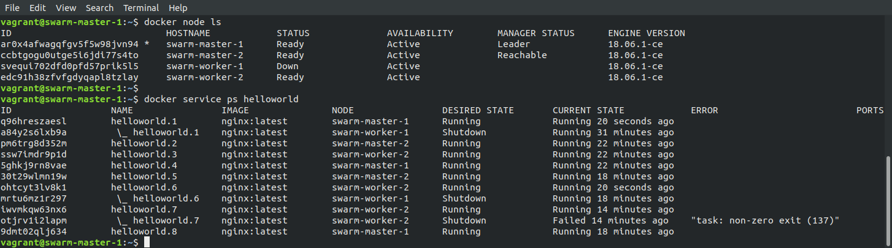

# beginner-devops-environment setup
Begin your devops learning locally by using this setup

In this Project I introduce the concept of configuration as code with Vagrant, 
go over configuration management with Ansible, 
then Containers and Container Orchestration with Docker and Docker Swarm.

Hands-On: Provision a Docker Swarm Cluster with Vagrant and Ansible
Automatically provision a Docker Swarm cluster composed of two masters and two workers
Preconditions:

    Linux, Windows or macOS host with at least 8GB RAM
    VirtualBox - https://www.virtualbox.org/
    Vagrant - https://www.vagrantup.com/

In this tutorial, we will learn some simple concepts about Infrastructure as Code (IaC) and we will cover a walkthrough of the Docker native container orchestrator, namely Swarm. This tool - once needing a separate installation, but now included in the Docker Engine setup - is analogous to Kubernetes, though much simpler and therefore more suitable for a first hands-on to container orchestration.

Similarly, the IaC topic will be explored with Vagrant, an automation layer above a hypervisor - in our case, VirtualBox. Vagrant leverages a declarative configuration file which describes all your software requirements, packages, operating system configuration, users, and more. With this tool, we will be able to provision four Linux nodes, based on a standard template image, with the proper properties in terms of hardware requirement and network configuration.

Once the nodes are provisioned, we will use Ansible for their configuration, turning them from plain Linux nodes to Docker hosts, and ultimately members of a multi-master Docker Swarm cluster. In order to do that, we will install Ansible master on one node, which will act as a configuration master for the others.
Code Overview

Through the Vagrant script (Vagrantfile) we provision four identical Linux machines (Ubuntu 20.04 LTS) on the same subnet:

nodes = [
  { :hostname => 'swarm-master-1', :ip => '192.168.77.10', :ram => 1024, :cpus => 1 },
  { :hostname => 'swarm-master-2', :ip => '192.168.77.11', :ram => 1024, :cpus => 1 },
  { :hostname => 'swarm-worker-1', :ip => '192.168.77.12', :ram => 1024, :cpus => 1 },
  { :hostname => 'swarm-worker-2', :ip => '192.168.77.13', :ram => 1024, :cpus => 1 }
]

Vagrant.configure("2") do |config|
  # Always use Vagrant's insecure key
  config.ssh.insert_key = false
  # Forward ssh agent to easily ssh into the different machines
  config.ssh.forward_agent = true
  # Provision nodes
  nodes.each do |node|
    config.vm.define node[:hostname] do |nodeconfig|
      nodeconfig.vm.box = "bento/ubuntu-20.04";
      nodeconfig.vm.hostname = node[:hostname] + ".box"
      nodeconfig.vm.network :private_network, ip: node[:ip]
      memory = node[:ram] ? node[:ram] : 1024;
      cpus = node[:cpus] ? node[:cpus] : 1;
      nodeconfig.vm.provider :virtualbox do |vb|
        vb.customize [
          "modifyvm", :id,
          "--memory", memory.to_s,
          "--cpus", cpus.to_s
        ]
      end
    end
  end
  # In addition, swarm-worker-2 is the Ansible server
  config.vm.define "swarm-worker-2" do |ansible|
    # Provision Ansible playbook
    ansible.vm.provision "file", source: "../Ansible", destination: "$HOME"
    # Install Ansible and configure nodes
    ansible.vm.provision "shell", path: "ansible.sh"
  end
end

A Bash script is then injected in node swarm-worker-2 to install Ansible via pip:

$ sudo apt-get install -y python-pip sshpass
$ sudo -H pip install --upgrade pip
$ sudo -H pip install ansible

The cluster configuration is carried out by means of three Ansible playbooks. The first one, cluster.yaml, installs Docker CE on all four hosts, regardless of their target role:

---
- hosts: all
  become: true
  vars_files:
  - vars.yml
  strategy: free

  tasks:
    - name: Add the docker signing key
      apt_key: url=https://download.docker.com/linux/ubuntu/gpg state=present

    - name: Add the docker apt repo
      apt_repository: repo='deb [arch=amd64] https://download.docker.com/linux/ubuntu focal stable' state=present

    - name: Install packages
      apt:
        name: "{{ PACKAGES }}"
        state: present
        update_cache: true
        force: yes

    - name: Add user vagrant to the docker group
      user:
        name: vagrant
        groups: docker
        append: yes

The second playbook, master.yaml, initializes the Docker Swarm, and configures the host named swarm-master-1 as the (leader) Swarm Manager.

---
- hosts: swarm-master-1
  become: true

  tasks:
    - name: Initialize the cluster
      shell: docker swarm init --advertise-addr 192.168.77.10 >> cluster_initialized.txt
      args:
        chdir: $HOME
        creates: cluster_initialized.txt

The last playbook, join.yaml, sets up the actual Docker Swarm as composed of four hosts - two masters (so that the manager role is redunded) and two workers. In order to achieve that, two join-tokens (one to join the cluster as a manager, and one to join the cluster as a worker) are generated on the host which initialized the swarm, and automatically passed to the remaining three hosts.

---
- hosts: swarm-master-1
  become: true
  gather_facts: false

  tasks:
    - name: Get master join command
      shell: docker swarm join-token manager
      register: master_join_command_raw

    - name: Set master join command
      set_fact:
        master_join_command: "{{ master_join_command_raw.stdout_lines[2] }}"

    - name: Get worker join command
      shell: docker swarm join-token worker
      register: worker_join_command_raw

    - name: Set worker join command
      set_fact:
        worker_join_command: "{{ worker_join_command_raw.stdout_lines[2] }}"

- hosts: swarm-master-2
  become: true

  tasks:
    - name: Master joins cluster
      shell: "{{ hostvars['swarm-master-1'].master_join_command }} >> node_joined.txt"
      args:
        chdir: $HOME
        creates: node_joined.txt

- hosts: workers
  become: true

  tasks:
    - name: Workers join cluster
      shell: "{{ hostvars['swarm-master-1'].worker_join_command }} >> node_joined.txt"
      args:
        chdir: $HOME
        creates: node_joined.txt

Step 1: Pull the Vagrant Box

We use Bento's Ubuntu 20.04 Vagrant Box - https://app.vagrantup.com/bento/boxes/ubuntu-20.04 - as the image template for all hosts. Enter a shell and type:

$ vagrant box add bento/ubuntu-20.04 --provider virtualbox

to pull the requested image from the Vagrant Cloud catalog.
Step 2: Run the Vagrantfile

Type the following commands:

$ cd Vagrant
$ vagrant up

This command executes the Vagrantfile, which in turn - as esplained above - installs Ansible and runs the playbooks. All this will take a few minutes. Eventually, our Docker Swarm Cluster will be set up and ready to be used.
Step 3: Verify the Swarm Cluster

Log in the first node using Vagrant's built-in SSH access as the vagrant user:

$ vagrant ssh swarm-master-1

On this node, which acts as a Swarm Manager, all nodes are now shown in the inventory:

$ vagrant@swarm-master-1:~$ docker node ls

The swarm manages individual containers on the nodes for us. Now we work on a higher level, with a new concept called Services. A service is an abstraction, that says: “I want to run this type of container, but I’m not going to start and manage the individual instances – I want the swarm to do that for me”.

So let’s create a very simple service.
Step 4: Start a Sample Service

We choose to create a service, naming it helloworld, based on the NGINX certified image, pulled from the Docker Hub (https://hub.docker.com/_/nginx/). We also instruct Docker to expose container’s port 80 (the default NGINX port) on the same external port for accessing the NGINX home page on a browser. Finally, we set Docker to deploy one running instance of the service, through the –replicas flag:

$ vagrant@swarm-master-1:~$ docker service create --replicas 1 --name helloworld --publish 80:80 nginx

We verify that the service is correctly listed:

vagrant@swarm-master-1:~$ docker service ls

vagrant@swarm-master-1:~$ docker service inspect --pretty helloworld

vagrant@swarm-master-1:~$ docker service ps helloworld

The NGINX default page can be accessed at http://192.168.77.10/. Note that the latter command tells us which node the container has been deployed to - i.e. docker-worker-1 this time, but that will change at each run. The running instance can be listed on the proper node, that we access using another console via SSH:

$ vagrant ssh swarm-worker-1

vagrant@swarm-worker-1:~$ docker ps

Now we can leverage one of the most powerful features of Docker Swarm: scaling. We first scale the number of replicas to four, and we expect that the Docker load balancer uses all four nodes for that. On the Swarm Manager terminal we type:

vagrant@swarm-master-1:~$ docker service scale helloworld=4
vagrant@swarm-master-1:~$ docker service ps helloworld

If we double the number of instances to eight, again Docker uses all four nodes in a balanced way to distribute the load:

vagrant@swarm-master-1:~$ docker service scale helloworld=8
vagrant@swarm-master-1:~$ docker service ps helloworld

We now inspect another key feature of Docker Swarm: high availability. We simulate the failure of one NGINX instance by forcing the destruction of a running container, e.g. on the swarm-worker-2 node:

As we can see, immediately after the removal of one of the two containers on the node, only one container is listed to be running.

Nevertheless, after a few seconds we see that, again, two containers are running on the node.

The Swarm Manager has detected the failure of one container (through constantly sent heartbeats) and redeployed one more replica to reach the desired state of eight running instances.

In this case, the chosen node is again swarm-worker-2, to balance the load among the swarm nodes.

Back to the Swarm Manager, we see that eight replicas of the NGINX server are up-and-running as desired, and track is kept of the failure of one container:

The same reliability mechanism takes place if the failure happens to one whole node: the Swarm Manager detects a node is missing, and quickly redistributes the container load to the remaining nodes. In order to simulate that, we can simply shutdown one the nodes, e.g. swarm-worker-1:

We finally inspect another remarkable feature of Docker: built-in discoverability. In the new swarm mode, containers can reach other containers running on other nodes through their domain names, which are dynamically assigned by Docker to their Container ID’s. This is called the routing mesh: it does discovery, and it also does load balancing within the swarm.

To see routing mesh in action, let’s scale down the swarm to have just two instances of the NGINX server. These happen to run on nodes swarm-master-1 and swarm-master-2:

If we access the NGINX home page with a browser at http://192.168.77.10/ (swarm-master-1) and at http://192.168.77.11/ (swarm-master-2), the page is displayed as expected. But if we access it at http://192.168.77.13/ (swarm-worker-2), that is on a node which doesn’t have thecontainer running, we still get the response! So how is that?

The active Swarm Manager gets the request, but it notes that it isn’t running a task which can handle the request on port 80. So it routes the request to a node that can handle it instead, and it all happens silently and transparently.
Step 5: Destroy the Service and the Docker Swarm

Stop the helloworld service:

vagrant@swarm-master-1:~$ docker service rm helloworld

Exit the swarm manager and destroy the cluster:

$ vagrant destroy --force

    Terms

  
